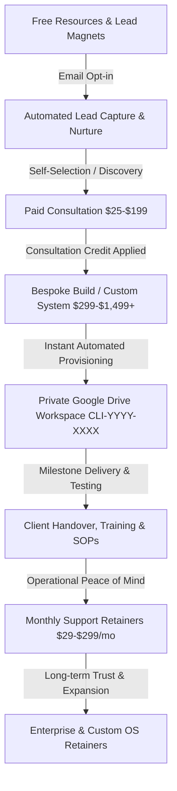

# STRATEGIC BUSINESS OPERATING SYSTEM
**Document ID:** STRAT-001  
**Version:** v1.0  
**Status:** ACTIVE  
**Owner:** Hemanth Ranam  
**Created:** 2026-09-26  
**Updated:** 2026-09-26  

---

## 1. Executive Summary & Purpose
The **Hemanth Ranam Professional Services OS** is a unified, scalable ecosystem connecting high-ticket business consulting, bespoke technical systems, modular digital products, and monthly retained partnerships into an automated, self-reinforcing flywheel.

### Core Value Proposition
- **High-Velocity Execution:** Transition clients from chaotic manual spreadsheets into automated, auditable, and resilient business operating architectures.
- **Fixed-Scope Clarity:** Zero open-ended time-and-materials ambiguity. 100% transparent pricing ($25 to $1,499+).
- **Zero Proprietary Lock-In:** Clients own 100% of their Google Workspace, Frappe/ERPNext, and automation code with zero proprietary black-box dependencies.

---

## 2. Customer Journey & The 10-Stage Flywheel

1. **Top of Funnel (Attraction):** 12 curated Free Resources (Audit Workbooks, CRM templates, Automation Checklists) driving high-intent organic and search traffic.
2. **Lead Intake & CRM Qualification:** Webhook routes intake submissions directly into the central Google Sheets CRM pipeline (`ENQUIRIES` & `LEADS` tabs).
3. **Paid Strategy & Audit Sessions:** Low-friction strategy sessions ($25–$199) with a **100% Consultation Credit Guarantee** (100% credited toward any subsequent build).
4. **Implementation & Bespoke Systems:** Modular builds across Websites, Business Systems, Google Apps Script, Frappe/ERPNext, and Trading Technology.
5. **Instant Automated Provisioning:** Stripe checkout triggers webhook (`backend/Code.gs`), generating a secure private Google Drive folder structure (`CLI-YYYY-XXXX`).
6. **Delivery & Rigorous Testing:** Complete delivery with test logs, acceptance criteria, and zero regression.
7. **Training & Handover:** Video walkthroughs, step-by-step SOPs, and user manuals provided in the client's Drive.
8. **Ongoing Retainer (MRR Engine):** Four-tier support retainers ($29/mo Starter Care to $299/mo Growth Partner) ensuring recurring revenue and ongoing optimization.

---

## 3. Revenue Architecture & Margin Economics

| Segment | Target Price Range | Margin Profile | Primary Objective |
| :--- | :--- | :--- | :--- |
| **Free Lead Magnets** | $0 | Infinite Lead Gen | Build subscriber list & trust |
| **Digital Products** | $5 – $99 | 98% Gross Margin | High-volume automated revenue |
| **Strategy & Audits** | $25 – $199 | 90% Gross Margin | Qualify buyers & scope builds |
| **Bespoke Implementations**| $299 – $1,499+ | 80% Gross Margin | Substantial cash flow injections |
| **Monthly Care Retainers** | $29 – $299/mo | 85% Gross Margin | Predictable recurring cash flow |

---

## 4. Operational Guardrails & Delivery Standards
1. **Scope Freeze:** Every custom project requires an agreed-upon Requirements Checklist before work commences.
2. **Single Truth Source:** All customer, order, and project states are synchronized between Stripe, Google Apps Script, Google Drive, and the central CRM Sheet.
3. **Risk Management:** Educational trading products strictly feature risk disclaimers with zero claims of guaranteed returns.
